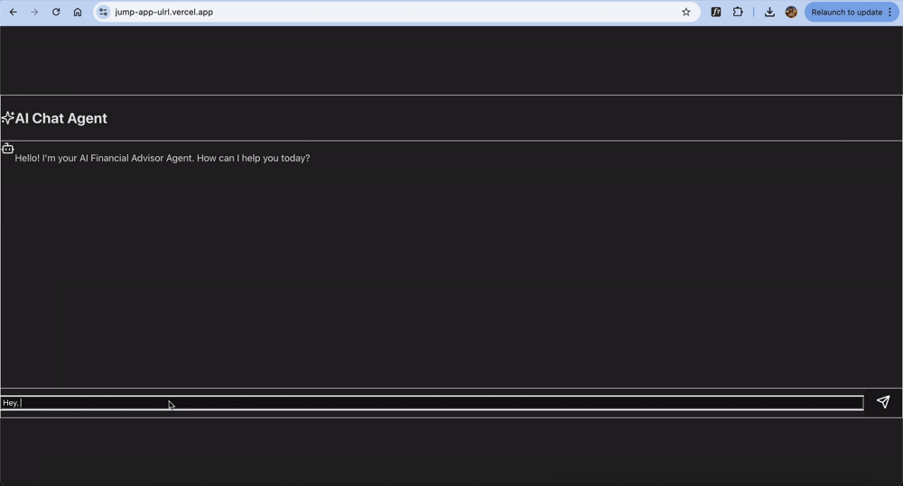
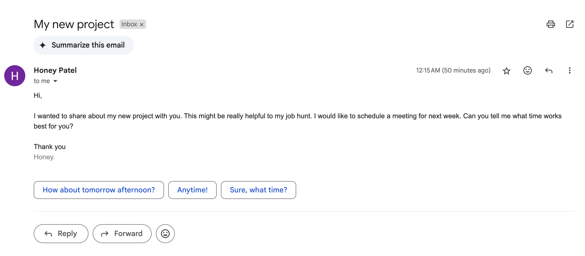
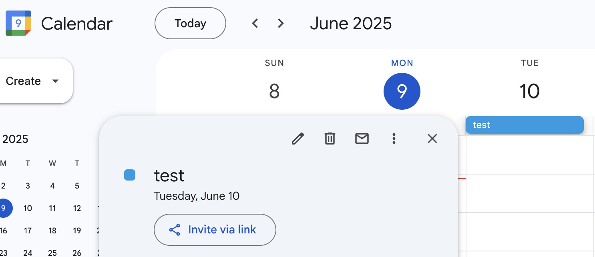
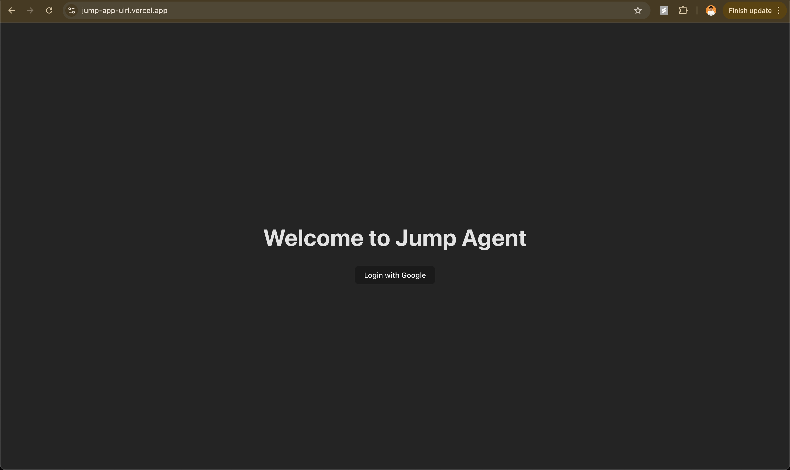
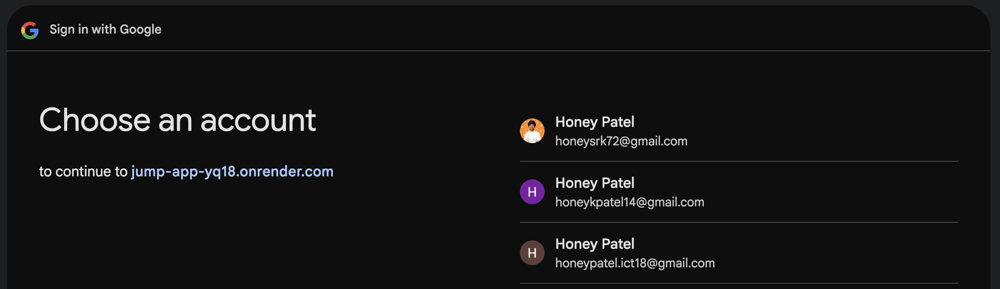
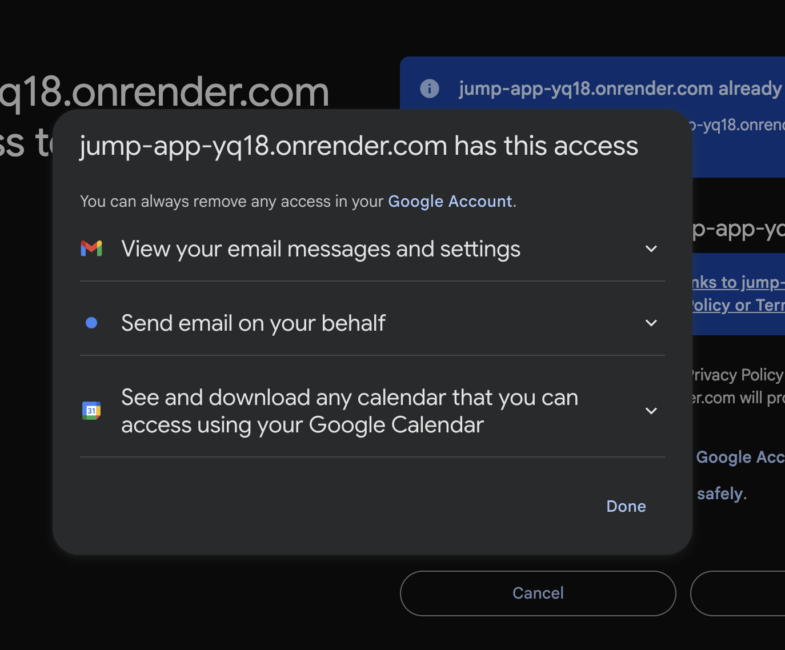
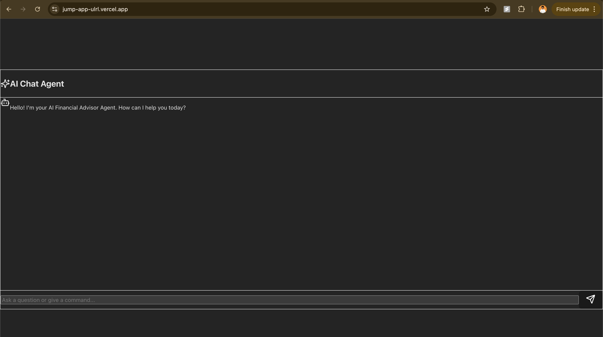
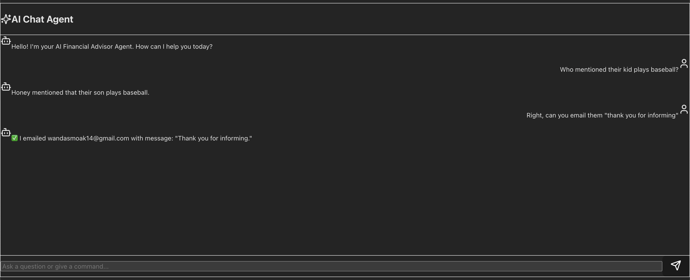

# 🧠 Jump Task

Live App 👉 https://jump-app-ulrl.vercel.app/

---

## 📚 Table of Contents

- [🧠 Jump Task](#-jump-task)
- [✨ Features](#-features)
- [✅ What Has Been Implemented](#-what-has-been-implemented)
- [🚧 What’s Left & Why](#-whats-left--why)
- [🎥 Live Demo](#-live-demo)
- [🛠 Tech Stack](#-tech-stack)
- [📸 Screenshots & Flow](#-screenshots--flow)
- [💡 Challenges Faced](#-challenges-faced)

---

## ✨ Features

- 🔐 Google OAuth login (Gmail + Calendar read/write access)
- 💬 Chat interface powered by GPT-4o
- 📥 Retrieve and understand recent 5 emails
- 🗓 View and analyze upcoming 5 calendar events
- 📧 Compose and send emails on your behalf
- 🤖 Agent reasoning and task execution via tool calling
- 📌 Contextual memory (e.g. "Who mentioned their kid plays baseball?")
- 📎 Event-aware responses (e.g. "Tell Sara to postpone our meeting")
- ✅ Deployed and working on Render (backend) and Vercel (frontend)

---

## ✅ What Has Been Implemented

- Full OAuth flow with Gmail + Calendar scopes
- Server-side tools:
  - get_recent_emails()
  - get_upcoming_events()
  - send_email()
  - reschedule_event()
- Natural language understanding for:
  - Email queries
  - Scheduling/rescheduling instructions
- Dynamic tool calling from OpenAI
- React + Tailwind chat interface
- Live deployment on Vercel/Render

---

## 🚧 What’s Left & Why

- ❌ HubSpot CRM Integration (OAuth + Contacts + Notes)

I have already created App on HubSpot and Generated API Key. However due to limited prior experience with HubSpot APIs and time constraints, it was deprioritized. However, the OAuth pattern for HubSpot is similar to Google's and can be implemented quickly using the same approach (`auth/hubspot`, `hubspot_callback`, etc.).

If selected, I can implement full HubSpot integration — including contact syncing, note creation, and RAG pipeline updates — immediately.

---

## 🎥 Live Demo

- ✉️ Email referred in demo
  

- 📅 Event referred in demo
  

---

## 🛠 Tech Stack

- 🧠 OpenAI GPT-4o (tool calling + RAG)
- ⚙️ FastAPI + Python (backend)
- 🔐 Google OAuth2 (email/calendar integration)
- 🖼 React + Vite + Tailwind (frontend)
- ☁️ Render (backend deployment)
- 🌐 Vercel (frontend hosting)

---

## 📸 Screenshots & Flow

### 1. Login screen

### 2. Google account selection

### 3. Google continue confirmation

### 4. Permission for email and calendar

### 5. Chat UI after login

### Other example:
- Who mentioned their kid plays baseball?
  
  

---

## 💡 Challenges Faced

- ⏱ Time pressure
- 🔐 Handling OAuth scope upgrades without forcing reconsent (solved)
- 🧠 Creating robust tool-calling logic that reacts to natural instructions like "Email Greg about today’s meeting" (solved)
- 🗃 Parsing and organizing context from calendar + email for GPT to use (solved)
- 🧪 Deployment debugging (vite errors, missing packages, environment vars, etc.)

---

If I was given chance to start over, I would focus more on implementing integration with HubSpot CRM, as it would add significant value to the app by allowing users to manage contacts and notes directly from the chat interface.

Thank you for the opportunity 🙏 I learned a lot.
